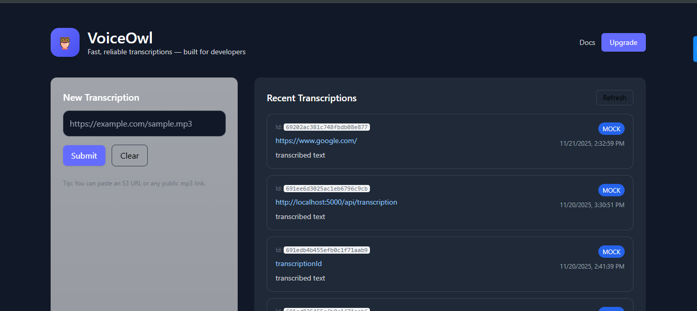

# VoiceOwl Backend – Developer Evaluation Task  
A minimal backend API built using **Node.js**, **TypeScript**, and **MongoDB** as part of the VoiceOwl developer evaluation task.  
The service accepts an **audio file URL**, performs a **mock transcription**, and stores the result in MongoDB.

---

## 🌐 Live Demo (Deployed on Render)

### **Frontend (React)**
🔗 https://voiceowl-frontend.onrender.com/

### **Backend API**
🔗 https://voiceowl-backend.onrender.com/api/

---

## 📸 Screenshot of Deployed Project

<p align="center">
  
</p>

## 🚀 Features
- Accept audio URL and generate transcription  
- Mock transcription engine  
- Store transcription records in MongoDB  
- REST API endpoints (create + list + get by ID)  
- Clean modular architecture  
- Built with TypeScript  
- Ready for Postman, Swagger, and Docker

---

## 📁 Folder Structure
```
voiceowl-backend/
│
├── src/
│   ├── app.ts
│   ├── server.ts
│   ├── controllers/
│   ├── routes/
│   ├── models/
│   ├── services/
│   ├── utils/
│   └── types/
│
├── tests/
├── .env
├── package.json
├── tsconfig.json
└── README.md
```

---

## 🛠️ Tech Stack
- Node.js  
- Express.js  
- TypeScript  
- MongoDB (Mongoose)  

---

## 📦 Installation
### 1. Clone Project
```bash
git clone https://github.com/your-username/voiceowl-backend.git
cd voiceowl-backend
```

### 2. Install Packages
```bash
npm install
```

### 3. Add `.env`
```
PORT=5000
MONGO_URI=mongodb://localhost:27017/voiceowl
```

---

## ▶️ Run Project
### Dev Mode
```bash
npm run dev
```

### Production
```bash
npm run build
npm start
```

---

## 🔗 API Endpoints

### 1️⃣ Create Transcription  
**POST** `/api/transcriptions`

#### Body:
```json
{
  "audioUrl": "https://example.com/audio.mp3"
}
```

---

### 2️⃣ Get All Transcriptions  
**GET** `/api/transcriptions`

---

### 3️⃣ Get Transcription by ID  
**GET** `/api/transcriptions/:id`

---

## 🧪 Mock Transcription Engine
The mock engine generates a fake transcription string + simulates delay.

File: `src/utils/mockTranscription.ts`

---

## 🗄️ MongoDB Schema
```
{
  audioUrl: String,
  transcription: String,
  status: "pending" | "completed",
  createdAt: Date
}
```

---

## 📤 POSTMAN COLLECTION (IMPORT READY)

Save the following JSON as `VoiceOwl.postman_collection.json` and import into Postman:

```json
{
  "info": {
    "name": "VoiceOwl Backend APIs",
    "_postman_id": "12345-voiceowl",
    "schema": "https://schema.getpostman.com/json/collection/v2.1.0/collection.json"
  },
  "item": [
    {
      "name": "Create Transcription",
      "request": {
        "method": "POST",
        "header": [],
        "body": {
          "mode": "raw",
          "raw": "{\n    \"audioUrl\": \"https://example.com/audio.mp3\"\n}"
        },
        "url": {
          "raw": "http://localhost:5000/api/transcriptions",
          "protocol": "http",
          "host": ["localhost"],
          "port": "5000",
          "path": ["api", "transcriptions"]
        }
      }
    },
    {
      "name": "Get All Transcriptions",
      "request": {
        "method": "GET",
        "header": [],
        "url": {
          "raw": "http://localhost:5000/api/transcriptions",
          "protocol": "http",
          "host": ["localhost"],
          "port": "5000",
          "path": ["api", "transcriptions"]
        }
      }
    },
    {
      "name": "Get Transcription by ID",
      "request": {
        "method": "GET",
        "url": {
          "raw": "http://localhost:5000/api/transcriptions/:id",
          "protocol": "http",
          "host": ["localhost"],
          "port": "5000",
          "path": ["api", "transcriptions", ":id"]
        }
      }
    }
  ]
}
```

---

## 📘 Swagger Documentation (Optional)

Add this file: `src/swagger.ts`

```ts
import swaggerJsdoc from "swagger-jsdoc";
import swaggerUi from "swagger-ui-express";

const options = {
  definition: {
    openapi: "3.0.0",
    info: {
      title: "VoiceOwl Backend API",
      version: "1.0.0"
    }
  },
  apis: ["./src/routes/*.ts"]
};

export const swaggerSpec = swaggerJsdoc(options);
export { swaggerUi };
```

Inside `app.ts`:

```ts
import { swaggerSpec, swaggerUi } from "./swagger";
app.use("/docs", swaggerUi.serve, swaggerUi.setup(swaggerSpec));
```

Visit Swagger:  
👉 **http://localhost:5000/docs**

---

## 🐳 Docker Setup

### `Dockerfile`
```dockerfile
FROM node:18

WORKDIR /app

COPY package*.json ./
RUN npm install

COPY . .

RUN npm run build

EXPOSE 5000

CMD ["npm", "start"]
```

### `docker-compose.yml`
```yaml
version: "3.8"

services:
  api:
    build: .
    ports:
      - "5000:5000"
    environment:
      - MONGO_URI=mongodb://mongo:27017/voiceowl
    depends_on:
      - mongo

  mongo:
    image: mongo:5
    restart: always
    ports:
      - "27017:27017"
```

Run:
```bash
docker-compose up --build
```

---

## 🧩 Part 2 – MongoDB Query & Indexing 

### ✔️ Query: Fetch transcriptions from the last 30 days  
The `GET /transcriptions` endpoint retrieves only the records created within the last 30 days.  
This is done using the `createdAt` field, which is automatically added by Mongoose because the schema uses `{ timestamps: true }`.

```ts
const thirtyDaysAgo = new Date(Date.now() - 30 * 24 * 60 * 60 * 1000);

const results = await Transcription.find({
  createdAt: { $gte: thirtyDaysAgo }
});

This ensures the database returns only recent transcription records without loading unnecessary documents.

✔️ Index needed for 100M+ records

If the dataset grows to 100 million+ transcription documents, scanning the entire collection for every “last 30 days” query becomes extremely expensive.

To optimize this, we add an index on createdAt:

TranscriptionSchema.index({ createdAt: 1 });


🧠 Why this index is important
Efficient range queries:
MongoDB can instantly locate documents within a time window (e.g., last 30 days) without scanning the full collection.

Enables index-based filtering:
Queries like

{ "createdAt": { "$gte": "2025-01-01" } }

are extremely fast when a createdAt index exists.
Critical at scale:
With tens of millions of documents, not having this index would result in:

High CPU usage

Slow response times

Increased disk I/O

Full collection scans on every request

Allows TTL, sharding, and partitioning strategies:
Time-based indexes are the foundation for:

TTL cleanup jobs

Time-range–based sharding keys

Cold storage archiving strategies

When querying large datasets (100M+ records), indexing createdAt is essential for fast time-range queries.
It avoids full collection scans, improves query latency, reduces load on the database, and prepares the system for horizontal scaling methods like sharding or partition pruning.

```


## 🏗️ Part 3 – Scalability & System Design 

### ✔️ Goal: Scale the service to handle 10k+ concurrent requests  
To evolve this API into a production-grade, high-throughput system, several architectural improvements are required. Below is a concise and practical scaling strategy.

```ts

---

### 🔹 1. **Introduce Queues for Heavy/Async Tasks**  
Directly transcribing audio inside the request cycle does **not** scale.  
For high traffic, the service must offload work to a queue:

- Use **Redis + BullMQ**, **RabbitMQ**, or **AWS SQS**
- `/transcription` endpoint → pushes job to queue  
- Worker processes handle:
  - downloading audio  
  - Azure speech transcription  
  - database writes  

**Benefits:**  
- API stays fast and responsive  
- Retries, dead-letter queues, and rate-limiting come for free  
- Allows horizontal scaling of workers independently from the API layer  

---

### 🔹 2. **Horizontal Scaling with Containers + Load Balancer**  
The backend should run in containers (Docker), deployed behind an auto-scaling load balancer:

- Kubernetes (GKE/EKS/AKS), AWS ECS, or Render Autoscaling  
- Multiple API instances → Load Balancer → Queue → Workers  
- MongoDB Atlas cluster for scalable storage  

This allows handling **10k+ concurrent connections** reliably.

---

### 🔹 3. **Caching to Reduce Load on the Database**  
For repeated reads (e.g., frontend polling), use:

- **Redis** for response caching  
- Cache recent transcriptions  
- Cache Azure API responses (if applicable)  

This significantly reduces MongoDB read pressure.

---

### 🔹 4. **MongoDB Optimizations for Large Datasets**  
With millions of documents, apply:

- Proper indexes (e.g., `createdAt`, `audioUrl`)
- Sharding (MongoDB Atlas)
- TTL indexes if old data can expire automatically

This ensures queries stay fast even with 100M+ records.

---

### 🔹 5. **CI/CD + Environment Separation**  
To support rapid scaling and iteration:

- GitHub Actions / GitLab CI for automated builds
- Separate dev, staging, and production environments
- Health checks, liveness probes, readiness probes

---

### ✔️ Summary  
By combining **queue-based processing**, **horizontal scaling**, **proper indexing**, and **strategic caching**, the VoiceOwl transcription service can reliably scale to **tens of thousands of concurrent requests** with predictable performance and cost efficiency.

```


## 🤝 Contribution
This repository is part of an evaluation and not open for external contributions.

---

## 📄 License
MIT License
